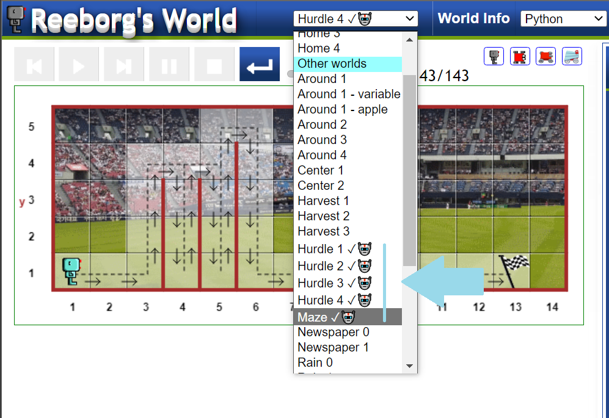

# Day 6: Python Functions & Karel

## Exercises
The codes are saved in [Saved Progress Folder](Saved%20Progress%20in%20Reeborg's%20World)
You can import this file in to thesight so that your progress can be updated and the codes are shown. It's saved as .json.

## Escaping the Maze

